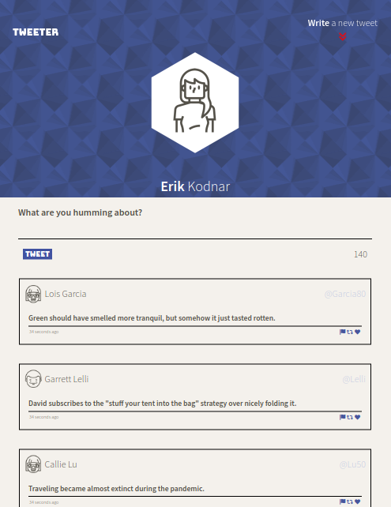
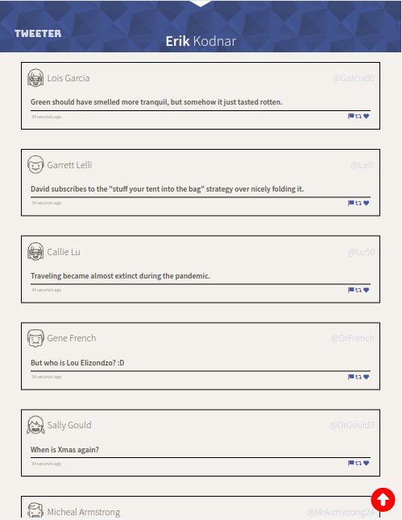
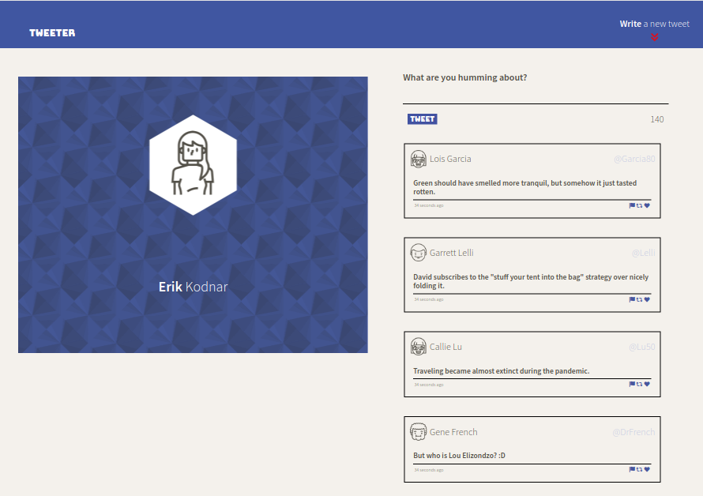
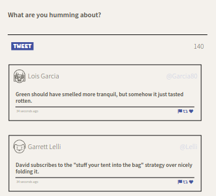

# Tweeter Project

Tweeter is a simple, single-page Twitter clone.

Demonstration of HTML, CSS, JS, jQuery and AJAX front-end skills, and Node, Express back-end skills.

Create a tweet! Post it! View existing tweets in reverse-chronological order. Character counter ensures tweets stay within the alotted amount. Error messages will inform the user if their tweet conforms to the expected standard. Responsive layout keeps the site usable from smart phones to large displays. 

## Screenshots

## Getting Started

1. Clone this repository onto your local device.
2. Install dependencies using the `npm install` command.
3. Start the web server using the `npm run local` command. The app will be served at <http://localhost:8080/>.
4. Go to <http://localhost:8080/> in your browser.

## Dependencies

- Express
- Node 5.10.x or above
- md5
- chance
- body-parser
